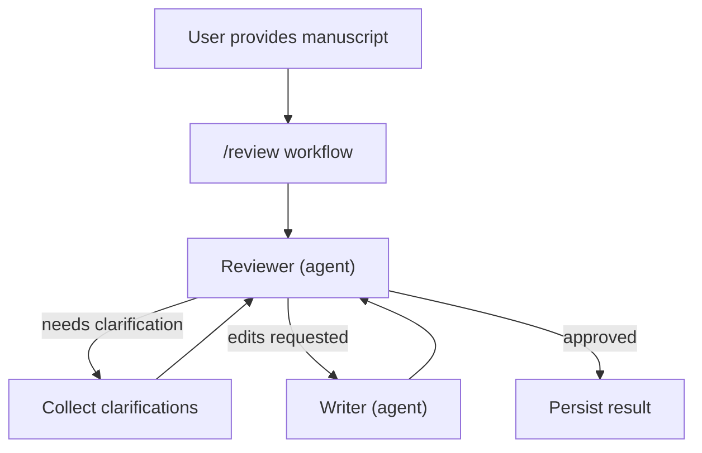

# SpecMaker

SpecMaker is a multi‑agent documentation system that guides engineers through structured, human‑in‑the‑loop flows to produce high‑quality, consistent, and AI‑readable specs.

This repository contains the Python core library powering SpecMaker. It builds on modern Python tooling, type‑safety, and validation with Pydantic v2, as well as agent orchestration with PydanticAI and DBOS.

## Status

Alpha (v0.0.1). Interfaces and APIs may change.

## Features

 - Multi‑agent authoring flow (Architect → Writer → Reviewer)
 - Human‑in‑the‑loop checkpoints and approvals
 - Durable orchestration via DBOS + PydanticAI (pause/resume, retries)
 - SQLite‑backed persistence and metadata extraction

## How it works

Currently, SpecMaker ships the `/review` workflow. Provide an existing manuscript; the Reviewer agent evaluates it, may request clarifications from you or loop with the Writer for edits; on approval, results are persisted.



## Getting Started (from source)

This project uses the `uv` Python toolchain for dependency management and execution.

```bash
# Clone your fork and enter the repo
git clone <your-fork-url>
cd specmaker

# Set up the Python environment
uv sync

 # Run tests
uv run --frozen pytest -q
 
 # Lint, format, type-check
uv run --frozen ruff format .
uv run --frozen ruff check .
uv run --frozen pyright
```

See `specmaker-core/README.md` for additional development notes and Docker/Devcontainer usage.

## Contributing

Contributions are welcome! Please read [CONTRIBUTING.md](CONTRIBUTING.md) for guidelines on setting up your environment, coding standards, and how to submit pull requests.

## Security

If you believe you’ve found a security vulnerability, please follow the process in [.github/SECURITY.md](.github/SECURITY.md).

## License

This project is licensed under the MIT License – see [LICENSE](LICENSE) for details.

## Citation

If you use SpecMaker in academic work, please see [CITATION.cff](CITATION.cff).

## Acknowledgements

Inspired by excellent open‑source practices from [Pydantic](https://github.com/pydantic/pydantic) and others.


